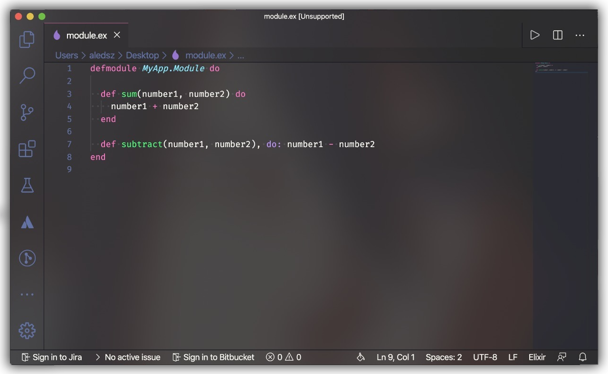

# 3.3 - Sintaxe

A sintaxe do Elixir se assemelha muito com o [Ruby](https://www.ruby-lang.org/pt/), o que facilita muito para programadores que estão migrando do Ruby para Elixir.

Resumidamente, a linguagem foi criada com uma sintaxe agradável e pouco verbosa para resolver a maioria dos problemas. Ou seja, o que você teria de escrever em 10 linhas em uma linguagem POO, você consegue com apenas 3~6 linhas com Elixir, e este não fica tão complexo de entender.

  

Outra coisa que precisa-se frisar, é que o Elixir trabalha com identação utilizando espaços de tamanho 2 (conforme descrito no rodapé do Visual Studio Code)